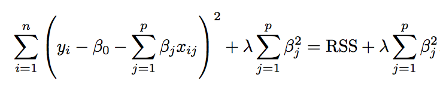
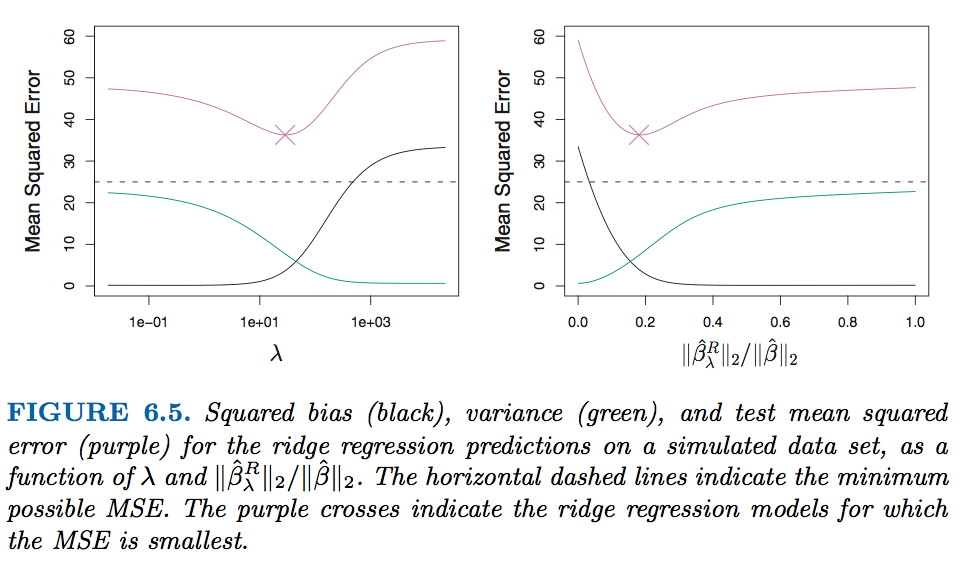
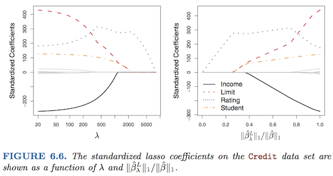
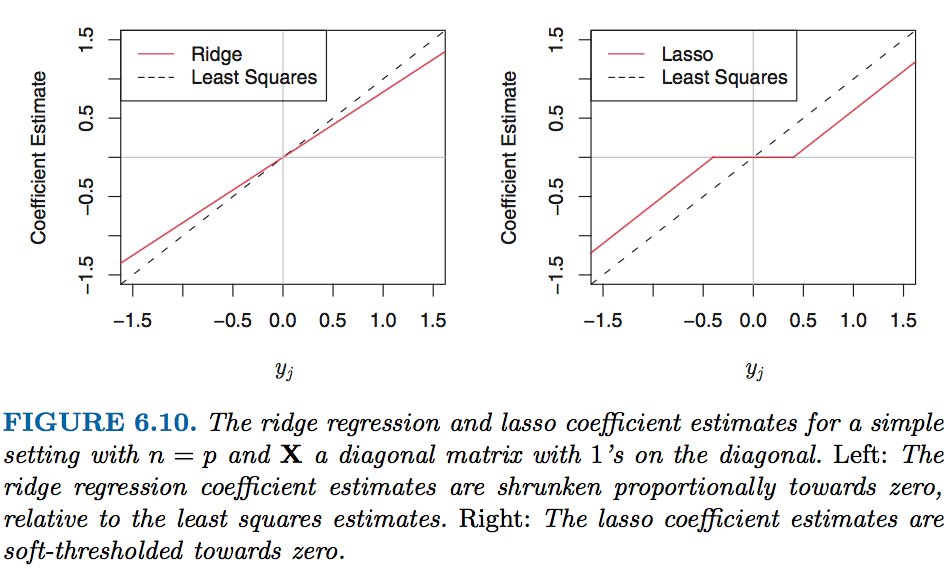

## Outline

1. Why Shrinkage ? 
2. Ridge Regression VS Lasso
3. Variable Selection
4. A Speicial Case 
5. Baesian Interpretation 
6. Selecting the Tuning Parameter

--- .class #id 

## Why Shrinkage ? 

### Shrinkage is a general technique to improve a least-squares estimator which consists in reducing the variance by adding constraints on the value of coefficients

- improve fitting 
- reduce variance

---

## Ridge Regression





where $\lambda \geq 0$ is a **tunning parameter**

$\lambda \sum_{j=1}^{p}\beta _{j}^{2}$ -> **shrinkage penalty**


---

## Ridge Regression (Continue.)



---

## Lasso 
### **(Least absolute shrinkage and selection operator, Tibshirani(1996))**


The $l1$ norm of a coefficient vector $\beta$ is given by $\left \| \beta  \right \| = \sum \left | \beta_{j} \right |$


---
## Connection between Ridge and Lasso

Here $I(\beta_{j} \neq 0)$ is an indicator variable: it takes on a value of 1 if $\beta \neq 0$, and equals zero otherwise.

This equation is equal to best subset selection. However, it is computationally infeasible when $p$ is large.
---
## Variable Selection


---
## A Speicial Case

### $n=p$ / $X$, a diagonal matrix with 1’s on the diagonal and 0’s in all off-diagonal elements.



---
## Baesian Interpretation 

A Bayesian viewpoint for regression assumes that the coefficient vector $\beta$ has some prior distribution, say $p(\beta)$, where $\beta = (\beta_{0},\beta_{1},...,\beta_{p})^{T}$ . The likelihood of the data can be written as f(Y |X,β), where $X = (X_{1}, . . . , X_{p})$.
$$P(\beta|X,Y) \propto f(Y|X,\beta)p(\beta|X) = f(Y|X,\beta)p(\beta)$$

assume the usual linear model,

$$ Y = \beta_{0} + X_{1}\beta_{1} + ... + X_{p}\beta_{p} + \varepsilon $$

---
## Baesian Interpretation (Continue.)


---

## Selecting the Tuning Parameter


---
## Lab

load library and use **model.matrix()** to automatically transforms any qualitative variables into dummy variables.

```{r message=FALSE}
library(ISLR);library(glmnet)
Hitters=na.omit(Hitters)
x=model.matrix(Salary~.,Hitters)[,-1]
y=Hitters$Salary
grid=10^seq(10,-2,length=100)
ridge.mod=glmnet(x,y,alpha=0,lambda=grid)
dim(coef(ridge.mod))
```

---

## Lab (Ridge Regression)
```{r message=FALSE}
ridge.mod$lambda [50]
coef(ridge.mod)[,50]
```

---


## Lab (Ridge Regression)
```{r message=FALSE}
ridge.mod$lambda [60]
coef(ridge.mod)[,60]
```

---


## Lab (Ridge Regression)
```{r message=FALSE}
predict(ridge.mod,s=50,type="coefficients")[1:20,]
```

---

## Lab (Ridge Regression)
```{r message=FALSE}
set.seed (1)
train=sample(1:nrow(x), nrow(x)/2)
test=(-train)
y.test=y[test]
ridge.mod=glmnet(x[train,],y[train],alpha=0,lambda=grid, thresh=1e-12)
ridge.pred=predict(ridge.mod,s=4,newx=x[test,])
mean((ridge.pred-y.test)^2)
mean((mean(y[train])-y.test)^2)
```

---

## Lab (Ridge Regression)
```{r message=FALSE}
ridge.pred=predict(ridge.mod, s = 1e10,newx = x[test,])
mean((ridge.pred-y.test)^2)

ridge.pred=predict(ridge.mod, s = 0,newx = x[test,],exact = T)
mean((ridge.pred-y.test)^2)

```


---
## Lab (Ridge Regression)
```{r , message=FALSE}
lm(y~x,subset = train)
predict(ridge.mod, s = 0, exact = T, type = "coeffcients")[1:20,]

```

---
## Lab (Ridge Regression)
```{r, fig.height = 4, fig.width = 8, fig.align = 'center', message=FALSE}
set.seed(1)
cv.out = cv.glmnet(x[train,],y[train],alpha=0)
plot(cv.out)
cv.out$lambda.min

```

---

## Lab (Ridge Regression)
```{r, message=FALSE}
ridge.pred=predict(ridge.mod, s = cv.out$lambda.min,newx = x[test,])
mean((ridge.pred-y.test)^2)

```

---
## Lab (Ridge Regression)
```{r, message=FALSE}
out = glmnet(x,y,alpha=0)
predict(out,type = "coefficients",s=cv.out$lambda.min)[1:20,]

```

---
## Lab (Lasso Regression)
```{r, fig.height = 4, fig.width = 8, fig.align = 'center', message=FALSE}
lasso.mod=glmnet(x[train ,],y[train],alpha=1,lambda=grid)
plot(lasso.mod)
```

---
## Lab (Lasso Regression)
```{r,fig.height = 4, fig.width = 8, fig.align = 'center', message=FALSE}
set.seed (1)
cv.out=cv.glmnet(x[train ,],y[train],alpha=1)
plot(cv.out)

```


---
## Lab (Lasso Regression)
```{r, message=FALSE}

bestlam=cv.out$lambda.min
lasso.pred=predict(lasso.mod,s=bestlam ,newx=x[test,])
mean((lasso.pred-y.test)^2)
```

---
## Lab (Lasso Regression)
```{r, message=FALSE}
out=glmnet(x,y,alpha=1,lambda=grid)
lasso.coef=predict(out,type="coefficients",s=bestlam)[1:20,]
lasso.coef
```

---
## Lab (Lasso Regression)
```{r, message=FALSE}
lasso.coef[lasso.coef!=0]
```

---

#Q & A

