## Outline

1. Why Shrinkage ? 
2. Ridge Regression VS Lasso
3. Variable Selection
4. A Speicial Case 
5. Baesian Interpretation 
6. Selecting the Tuning Parameter

--- .class #id 

## Why Shrinkage ? 

### Shrinkage is a general technique to improve a least-squares estimator which consists in reducing the variance by adding constraints on the value of coefficients

- improve fitting 
- reduce variance

---

## Ridge Regression


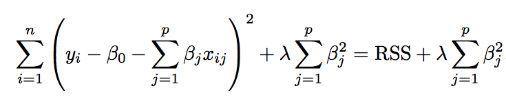


where $\lambda \geq 0$ is a **tunning parameter**

$\lambda \sum_{j=1}^{p}\beta _{j}^{2}$ -> **shrinkage penalty**

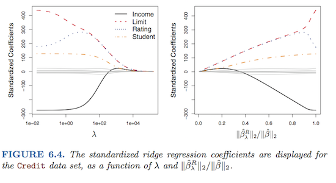

---

## Ridge Regression (Continue.)

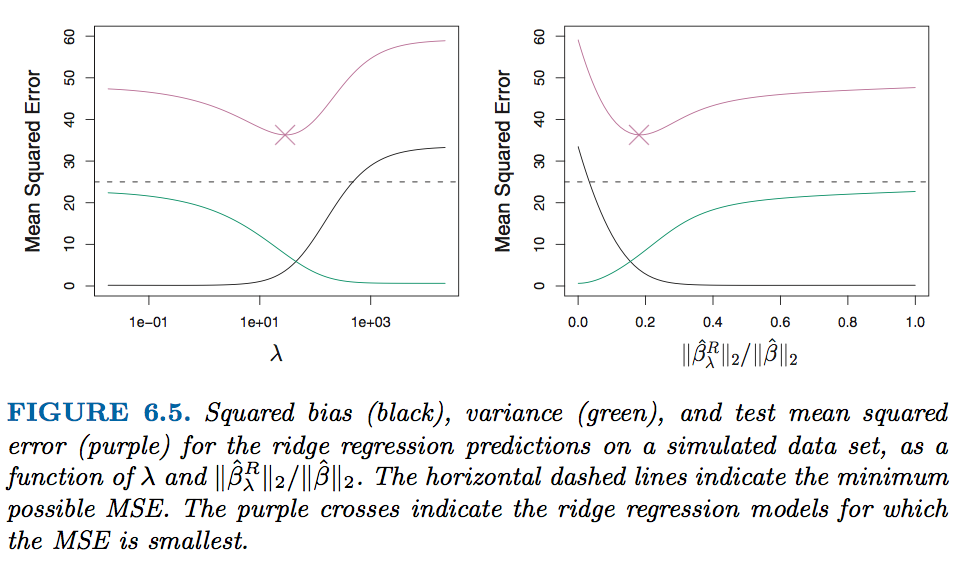

---

## Lasso 
### **(Least absolute shrinkage and selection operator, Tibshirani(1996))**


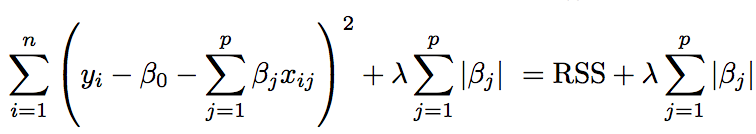


The $l1$ norm of a coefficient vector $\beta$ is given by $\left \| \beta  \right \| = \sum \left | \beta_{j} \right |$

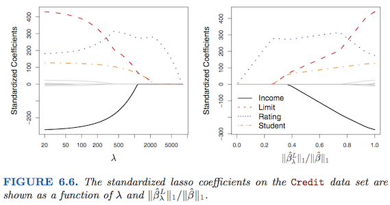
---
## Connection between Ridge and Lasso

Here $I(\beta_{j} \neq 0)$ is an indicator variable: it takes on a value of 1 if $\beta \neq 0$, and equals zero otherwise.

This equation is equal to best subset selection. However, it is computationally infeasible when $p$ is large.
---
## Variable Selection

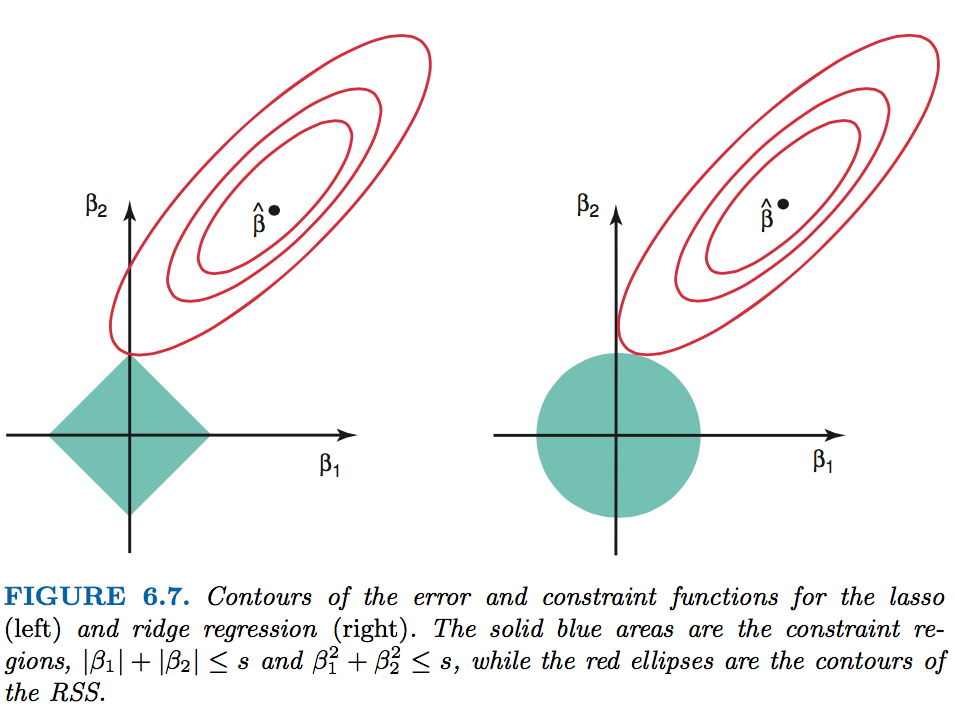

---
## A Speicial Case

### $n=p$ / $X$, a diagonal matrix with 1’s on the diagonal and 0’s in all off-diagonal elements.

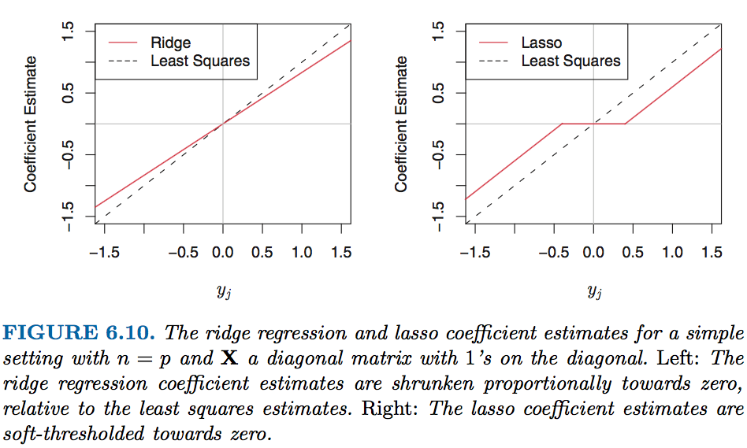

---
## Baesian Interpretation 

A Bayesian viewpoint for regression assumes that the coefficient vector $\beta$ has some prior distribution, say $p(\beta)$, where $\beta = (\beta_{0},\beta_{1},...,\beta_{p})^{T}$ . The likelihood of the data can be written as f(Y |X,β), where $X = (X_{1}, . . . , X_{p})$.
$$P(\beta|X,Y) \propto f(Y|X,\beta)p(\beta|X) = f(Y|X,\beta)p(\beta)$$

assume the usual linear model,

$$ Y = \beta_{0} + X_{1}\beta_{1} + ... + X_{p}\beta_{p} + \varepsilon $$

---
## Baesian Interpretation (Continue.)

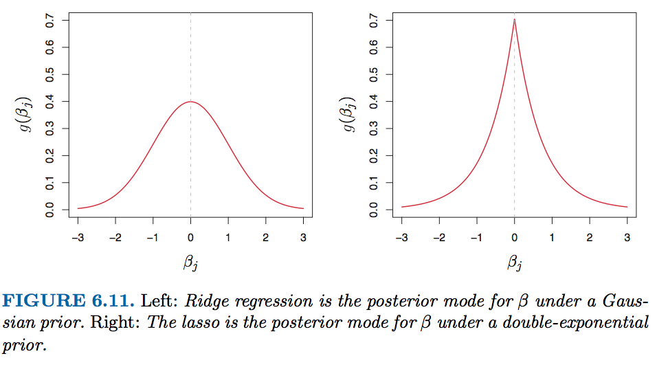

---

## Selecting the Tuning Parameter


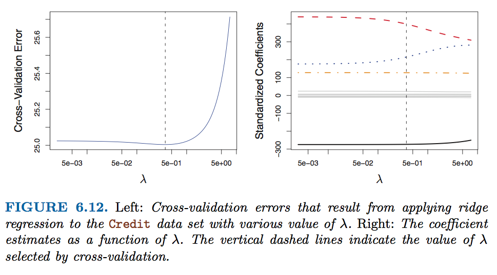

---
## Lab

load library and use **model.matrix()** to automatically transforms any qualitative variables into dummy variables.


```r
library(ISLR);library(glmnet)
Hitters=na.omit(Hitters)
x=model.matrix(Salary~.,Hitters)[,-1]
y=Hitters$Salary
grid=10^seq(10,-2,length=100)
ridge.mod=glmnet(x,y,alpha=0,lambda=grid)
dim(coef(ridge.mod))
```

```
## [1]  20 100
```

---

## Lab (Ridge Regression)

```r
ridge.mod$lambda [50]
```

```
## [1] 11497.57
```

```r
coef(ridge.mod)[,50]
```

```
##   (Intercept)         AtBat          Hits         HmRun          Runs 
## 407.356050200   0.036957182   0.138180344   0.524629976   0.230701523 
##           RBI         Walks         Years        CAtBat         CHits 
##   0.239841459   0.289618741   1.107702929   0.003131815   0.011653637 
##        CHmRun         CRuns          CRBI        CWalks       LeagueN 
##   0.087545670   0.023379882   0.024138320   0.025015421   0.085028114 
##     DivisionW       PutOuts       Assists        Errors    NewLeagueN 
##  -6.215440973   0.016482577   0.002612988  -0.020502690   0.301433531
```

---


## Lab (Ridge Regression)

```r
ridge.mod$lambda [60]
```

```
## [1] 705.4802
```

```r
coef(ridge.mod)[,60]
```

```
##  (Intercept)        AtBat         Hits        HmRun         Runs 
##  54.32519950   0.11211115   0.65622409   1.17980910   0.93769713 
##          RBI        Walks        Years       CAtBat        CHits 
##   0.84718546   1.31987948   2.59640425   0.01083413   0.04674557 
##       CHmRun        CRuns         CRBI       CWalks      LeagueN 
##   0.33777318   0.09355528   0.09780402   0.07189612  13.68370191 
##    DivisionW      PutOuts      Assists       Errors   NewLeagueN 
## -54.65877750   0.11852289   0.01606037  -0.70358655   8.61181213
```

---


## Lab (Ridge Regression)

```r
predict(ridge.mod,s=50,type="coefficients")[1:20,]
```

```
##   (Intercept)         AtBat          Hits         HmRun          Runs 
##  4.876610e+01 -3.580999e-01  1.969359e+00 -1.278248e+00  1.145892e+00 
##           RBI         Walks         Years        CAtBat         CHits 
##  8.038292e-01  2.716186e+00 -6.218319e+00  5.447837e-03  1.064895e-01 
##        CHmRun         CRuns          CRBI        CWalks       LeagueN 
##  6.244860e-01  2.214985e-01  2.186914e-01 -1.500245e-01  4.592589e+01 
##     DivisionW       PutOuts       Assists        Errors    NewLeagueN 
## -1.182011e+02  2.502322e-01  1.215665e-01 -3.278600e+00 -9.496680e+00
```

---

## Lab (Ridge Regression)

```r
set.seed (1)
train=sample(1:nrow(x), nrow(x)/2)
test=(-train)
y.test=y[test]
ridge.mod=glmnet(x[train,],y[train],alpha=0,lambda=grid, thresh=1e-12)
ridge.pred=predict(ridge.mod,s=4,newx=x[test,])
mean((ridge.pred-y.test)^2)
```

```
## [1] 101036.8
```

```r
mean((mean(y[train])-y.test)^2)
```

```
## [1] 193253.1
```

---

## Lab (Ridge Regression)

```r
ridge.pred=predict(ridge.mod, s = 1e10,newx = x[test,])
mean((ridge.pred-y.test)^2)
```

```
## [1] 193253.1
```

```r
ridge.pred=predict(ridge.mod, s = 0,newx = x[test,],exact = T)
```

```
## Error: problem with predict.glmnet() or coef.glmnet(): unable to refit the glmnet object to compute exact coefficients; please supply original data by name, such as x and y, plus any weights, offsets etc.
```

```r
mean((ridge.pred-y.test)^2)
```

```
## [1] 193253.1
```


---
## Lab (Ridge Regression)

```r
lm(y~x,subset = train)
```

```
## 
## Call:
## lm(formula = y ~ x, subset = train)
## 
## Coefficients:
## (Intercept)       xAtBat        xHits       xHmRun        xRuns  
##   299.42849     -2.54027      8.36682     11.64512     -9.09923  
##        xRBI       xWalks       xYears      xCAtBat       xCHits  
##     2.44105      9.23440    -22.93673     -0.18154     -0.11598  
##     xCHmRun       xCRuns        xCRBI      xCWalks     xLeagueN  
##    -1.33888      3.32838      0.07536     -1.07841     59.76065  
##  xDivisionW     xPutOuts     xAssists      xErrors  xNewLeagueN  
##   -98.86233      0.34087      0.34165     -0.64207     -0.67442
```

```r
predict(ridge.mod, s = 0, exact = T, type = "coeffcients")[1:20,]
```

```
## Error in match.arg(type): 'arg' should be one of "link", "response", "coefficients", "nonzero", "class"
```

---
## Lab (Ridge Regression)

```r
set.seed(1)
cv.out = cv.glmnet(x[train,],y[train],alpha=0)
plot(cv.out)
```

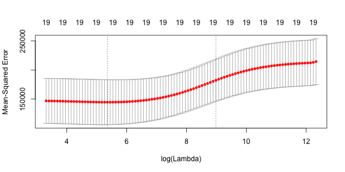

```r
cv.out$lambda.min
```

```
## [1] 211.7416
```

---

## Lab (Ridge Regression)

```r
ridge.pred=predict(ridge.mod, s = cv.out$lambda.min,newx = x[test,])
mean((ridge.pred-y.test)^2)
```

```
## [1] 96015.51
```

---
## Lab (Ridge Regression)

```r
out = glmnet(x,y,alpha=0)
predict(out,type = "coefficients",s=cv.out$lambda.min)[1:20,]
```

```
##  (Intercept)        AtBat         Hits        HmRun         Runs 
##   9.88487157   0.03143991   1.00882875   0.13927624   1.11320781 
##          RBI        Walks        Years       CAtBat        CHits 
##   0.87318990   1.80410229   0.13074381   0.01113978   0.06489843 
##       CHmRun        CRuns         CRBI       CWalks      LeagueN 
##   0.45158546   0.12900049   0.13737712   0.02908572  27.18227535 
##    DivisionW      PutOuts      Assists       Errors   NewLeagueN 
## -91.63411299   0.19149252   0.04254536  -1.81244470   7.21208390
```

---
## Lab (Lasso Regression)

```r
lasso.mod=glmnet(x[train ,],y[train],alpha=1,lambda=grid)
plot(lasso.mod)
```

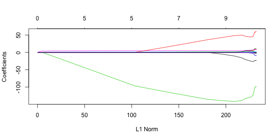

---
## Lab (Lasso Regression)

```r
set.seed (1)
cv.out=cv.glmnet(x[train ,],y[train],alpha=1)
plot(cv.out)
```

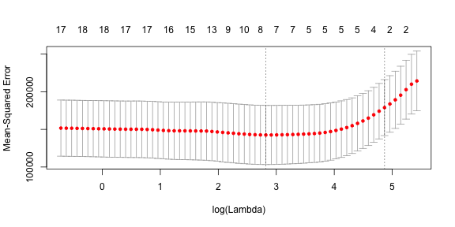


---
## Lab (Lasso Regression)

```r
bestlam=cv.out$lambda.min
lasso.pred=predict(lasso.mod,s=bestlam ,newx=x[test,])
mean((lasso.pred-y.test)^2)
```

```
## [1] 100743.4
```

---
## Lab (Lasso Regression)

```r
out=glmnet(x,y,alpha=1,lambda=grid)
lasso.coef=predict(out,type="coefficients",s=bestlam)[1:20,]
lasso.coef
```

```
##  (Intercept)        AtBat         Hits        HmRun         Runs 
##   18.5394844    0.0000000    1.8735390    0.0000000    0.0000000 
##          RBI        Walks        Years       CAtBat        CHits 
##    0.0000000    2.2178444    0.0000000    0.0000000    0.0000000 
##       CHmRun        CRuns         CRBI       CWalks      LeagueN 
##    0.0000000    0.2071252    0.4130132    0.0000000    3.2666677 
##    DivisionW      PutOuts      Assists       Errors   NewLeagueN 
## -103.4845458    0.2204284    0.0000000    0.0000000    0.0000000
```

---
## Lab (Lasso Regression)

```r
lasso.coef[lasso.coef!=0]
```

```
##  (Intercept)         Hits        Walks        CRuns         CRBI 
##   18.5394844    1.8735390    2.2178444    0.2071252    0.4130132 
##      LeagueN    DivisionW      PutOuts 
##    3.2666677 -103.4845458    0.2204284
```

---

#Q & A

